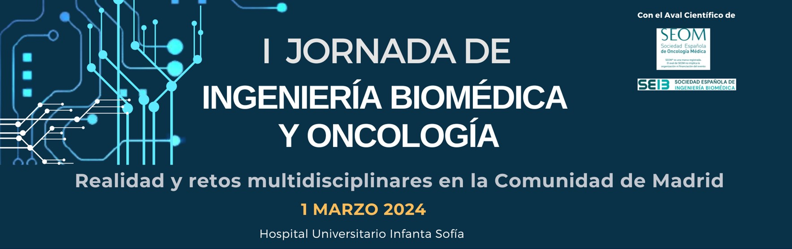

| [Programa](#programa) | [Inscripción](#inscripción) | [Patrocinadores](#patrocinadores) |

# Realidad y retos multidisciplinares en la Comunidad de Madrid

> Te invitamos a participar en las **I Jornadas de Ingeniería Biomédica y Oncología** que se celebrarán el **1 de marzo** en el **Hospital Universitario Infanta Sofía**.
> 
> Estas jornadas tienen como objetivo establecer un foro madrileño de encuentro entre oncólogos e ingenieros biomédicos en el que se compartan experiencias e ideas sobre cómo la ingeniería biomédica puede ayudar a afrontar los retos sanitarios en el ámbito oncológico.

## PROGRAMA

texto resaltado en rojo

<a href="#" style="background-color: #4CAF50; color: white; padding: 10px 20px; text-align: center; text-decoration: none; display: inline-block; font-size: 16px; margin: 4px 2px; cursor: pointer; border-radius: 5px;">Haz clic</a>

|9.30-9.45 - **ACTO INAUGURAL**|  
|:------------|
|* **Enrique Casado Sáenz**, Jefe de Oncología HUIS. * **Enrique J. Gómez-Aguilera**, Catedrático de la Universidad Politécnica de Madrid y Presidente de la Sociedad Española de Ingeniería Biomédica| 
|9.45-10.05 - **INTRODUCCIÓN**|
|* **Oncología e Ingeniería Biomédica**, Enrique Casado y Enrique J. Gómez |
|10.05-11.05 - **MESA 1**. INTELIGENCIA ARTIFICIAL Y CUIDADOS ONCOLÓGICOS BASADOS EN EL VALOR|
|* 10:05-10:20- **INFOBANCO** **Juan Luis Cruz Bermúdez**, Jefe de Serviciode Informática del Hospital Universitario 12 deOctubre.|
|10:20-10:35 - **CLARIFY (Cancer LongSurvivors Artificial Intelligence FollowUp)** **María Torrente**, Jefa de ProgramasInternacionales de Medicina del Hospital Universitario Puerta de Hierro.|
|10:35.10:50 - **SAVANA y Oncología** **Andrés Muñoz**, Oncólogo en Hospital General Universitario Gregorio Marañón y Coordinador del Grupo de Trabajo deTrombosis y Cáncer de la SEOM.|
|10:50-11:05 - **Discusión**|
|9.30-9.45 - **MESA 2**. SALUD DIGITAL Y TELEMEDICINA EN ONCOLOGÍA|
|* 11:05-11:20 - **InnovaHONCO** **David Gutiérrez Abad**, Oncólogo en el HospitalUniversitario de Fuenlabrada. * 11:20-11:45 - **mHEALTH-Alibird** **María Sereno Moyano**, Oncóloga, HUIS **José Iniesta**, Ingeniero Biomédico, UPM. * 11:45-12:00 - **Discusión**.|
|12:00-12:40 - **CAFÉ Y FORO EN MESAS**|
|12:40-13:20 - **MESA 3**. PROCESOS. EL CIRCUITO DE TRATAMIENTO ONCOLÓGICO|
|* 12:40-12:55- **HOPE (Hospital de DíaPersonalizado)** **Cristina Caramés**, Oncóloga, DirectoraAsistencial e Investigación, QuirónSalud. * 12:55-13:10 - **OncoTrack** **Enrique Casado**, Oncólogo, HUIS. **Eduardo Cañada**, Jefe Informática HUIS. * 13:10-13:25 - **Discusión**.|
|* 13:25-13:50 - **Cirugía digital**. **José María Balibrea**, Jefe División deCirugía Bariátrica y Endocrino-Metabólica H. Germans Trias i Pujol. * 13:50-14:05 - **Radiómica en Oncología**. **Patricia Sánchez**, Universidad Politécnicade Madrid * 14:05-14:20 - **Inteligencia Artificial y Humanización de la Medicina. Retos yoportunidades.** **Joaquín Ojeda**,Neurólogo. PresidenteCómite ética Asistencias y neurólogo HUIS. * 14:20-14:35 - **Discusión**.|
|14:35-14:40 - **CLAUSURA**|
 

[Descargar tríptico](./another-page.html).
 
 

## INSCRIPCIÓN
[Rellenar el formulario](./another-page.html).
 
 
* * *

## PATROCINADORES 
 
 
* * *

### And a nested list:

- level 1 item
  - level 2 item
  - level 2 item
    - level 3 item
    - level 3 item
- level 1 item
  - level 2 item
  - level 2 item
  - level 2 item
- level 1 item
  - level 2 item
  - level 2 item
- level 1 item

### Small image

### Large image

