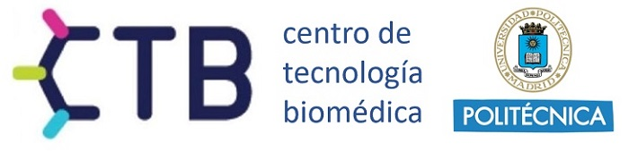
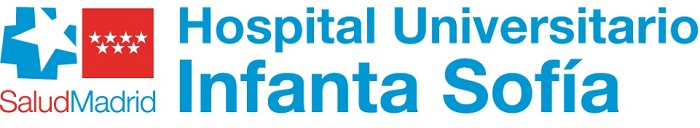
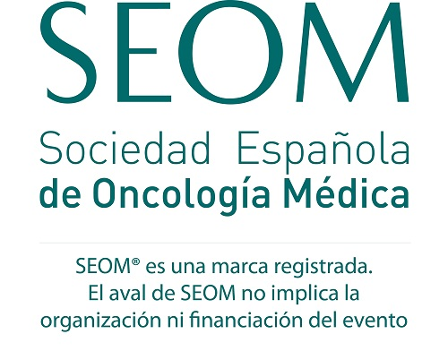

| [Programa](#programa) | [Inscripción](#inscripción) | [Organizadores](#organizadores) |

### Realidad y retos multidisciplinares en la Comunidad de Madrid

> Te invitamos a participar en las **I Jornadas de Ingeniería Biomédica y Oncología** que se celebrarán el **1 de marzo** en el **Hospital Universitario Infanta Sofía**.
> 
> Estas jornadas tienen como objetivo establecer un foro madrileño de encuentro entre oncólogos e ingenieros biomédicos en el que se compartan experiencias e ideas sobre cómo la ingeniería biomédica puede ayudar a afrontar los retos sanitarios en el ámbito oncológico.

## PROGRAMA

<a href="https://drive.upm.es/s/XSdonk7wCMHeS77" style="background-color: #7EBCB5; color: white; padding: 10px 20px; text-align: center; text-decoration: none; display: inline-block; font-size: 10px; margin: 4px 2px; cursor: pointer; border-radius: 5px;">Descargar</a>

### 09:30-09:50 - PRESENTACIÓN E INTRODUCCIÓN 
- **Enrique Casado Sáenz**, *Jefe de Oncología, Hospital Universitario Infanta Sofía (HUIS)*.
- **Enrique J. Gómez-Aguilera**, *Catedrático de la Universidad Politécnica de Madrid y Presidente de la Sociedad Española de Ingeniería Biomédica*.
- **Javier de Castro**, *Vicepresidente de la Sociedad Española de Oncología Médica (SEOM)*.

#### Coordinación/moderación de sesiones: Enrique Casado y Enrique J. Gómez

### 09:50-10:50 - MESA 1. INTELIGENCIA ARTIFICIAL Y CUIDADOS ONCOLÓGICOS BASADOS EN EL VALOR 

#### 09:50-10:05 - Plataforma de datos: INFOBANCO
- **Juan Luis Cruz Bermúdez**, *Director de Transformación Digital, Hospital Universitario 12 de Octubre*.

#### 10:05-10:20 - CLARIFY (Cancer Long Survivors Artificial Intelligence Follow Up)
- **María Torrente**, *Jefa de Programas Internacionales de Medicina, Hospital Universitario Puerta de Hierro*.

#### 10:20.10:35 - SAVANA y Oncología
- **Miren Taberna**, *Chief Scientific Officer Savana, Oncóloga*.

#### 10:35-10:50 - Discusión

### 10:50-11:40 - MESA 2. SALUD DIGITAL Y TELEMEDICINA EN ONCOLOGÍA  

#### 10:50-11:10 - mHEALTH-Alibird
- **María Sereno Moyano**, *Oncóloga, HUIS*.
- **Jose Iniesta**, *Ingeniero Biomédico, UPM*.

#### 11:10-11:25 - InnovaHONCO
- **David Gutiérrez Abad**, *Oncólogo, Hospital Universitario de Fuenlabrada*.

#### 11:25-11:40 - Discusión

### 11:40-12:20 - Café y foro en mesas   

### 12:20-13:05 - MESA 3. PROCESOS. EL CIRCUITO DE TRATAMIENTO ONCOLÓGICO   

#### 12:20-12:35- HOPE (Hospital de Día Personalizado)
- **Cristina Caramés**, *Directora Asistencial e Investigación, Oncóloga, QuirónSalud*.

#### 12:35-12:50 - OncoTrack
- **Enrique Casado**, *Oncólogo, Jefe de Oncología, HUIS*.
- **Eduardo Cañada**, *Jefe Informática, HUIS*.

#### 12:50-13:05 - Discusión

### 13:05-14:15 - MESA 4. CIRUGÍA E IMAGEN MÉDICA. BIOÉTICA   

#### 13:05-13:30 - Cirugía digital
- **José María Balibrea**, *Jefe de la División de Cirugía Bariátrica y Endocrino-Metabólica, Hospital Germans Trias i Pujol*.

#### 13:30-13:45 - Radiómica en Oncología
- **Patricia Sánchez**, *Profesora de la Universidad Politécnicade Madrid*.

#### 13:45-14:00 - Inteligencia Artificial y Humanización de la Medicina. Retos y oportunidades.
- **Joaquín Ojeda**, *Presidente del Cómite de Ética Asistencial, Neurólogo, HUIS*.

#### 14:00-14:15 - Discusión

### 14:35-14:40 - CLAUSURA   
- **Antonio Romero Plasencia**, *Director Gerente del Hospital Universitario Infanta Sofía*.
- **Ana Ramírez de Molina**, *Viceconsejera de Universidades, Investigación y Ciencia de la Comunidad de Madrid*.

 
* * *

## CUÁNDO Y DÓNDE
#### Viernes 1 de Marzo de 2024   
**Aula Magna** del Hospital Universitario Infanta Sofía
 
*Avenida de Europa, 34* 
 
*San Sebastián de los Reyes, Madrid*

 
* * *

## INSCRIPCIÓN
### Completa el siguiente formulario para registrarte!

<a href="https://docs.google.com/forms/d/e/1FAIpQLScxaYG1qYPPrmg5h8QCs2LVK8G115P-D6Lkrcbr7eucIRWFug/viewform?usp=sf_link" style="background-color: #7EBCB5; color: white; padding: 10px 20px; text-align: center; text-decoration: none; display: inline-block; font-size: 10px; margin: 4px 2px; cursor: pointer; border-radius: 5px;">Registrarse</a>

 
* * *

## ORGANIZADORES 

| Comité organizador        | 
|:-------------|
| Enrique J. Gómez, UPM-SEIB         | 
| María Sereno, HUIS | 
| Enrique Casado, HUIS           |

 

     
     
    

 
* * *
 

### Con el aval de las sociedades españolas de Oncología Médica e Ingeniería Biomédica (SEOM y SEIB)
 

     
     

#### Contacto

>
> Si tienes cualquier duda... [Ponte en contacto con Secretaría Técnica de las JIBO](mailto:jibo.secretariatecnica@gmail.com)
> 
