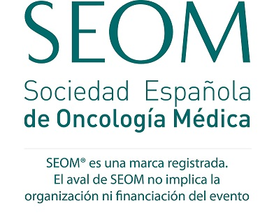

| [Programa](#programa) | [Inscripción](#inscripción) | [Patrocinadores](#patrocinadores) |

### Realidad y retos multidisciplinares en la Comunidad de Madrid

> Te invitamos a participar en las **I Jornadas de Ingeniería Biomédica y Oncología** que se celebrarán el **1 de marzo** en el **Hospital Universitario Infanta Sofía**.
> 
> Estas jornadas tienen como objetivo establecer un foro madrileño de encuentro entre oncólogos e ingenieros biomédicos en el que se compartan experiencias e ideas sobre cómo la ingeniería biomédica puede ayudar a afrontar los retos sanitarios en el ámbito oncológico.

## PROGRAMA

<a href="https://drive.upm.es/s/EA3dqD8ZihFfFIH" style="background-color: #7EBCB5; color: white; padding: 10px 20px; text-align: center; text-decoration: none; display: inline-block; font-size: 10px; margin: 4px 2px; cursor: pointer; border-radius: 5px;">Descargar</a>

### 9.30-9.45 - ACTO INAUGURAL 
- **Enrique Casado Sáenz**, *Jefe de Oncología HUIS*.
- **Enrique J. Gómez-Aguilera**, *Catedrático de la Universidad Politécnica de Madrid y Presidente de la Sociedad Española de Ingeniería Biomédica*.

### 9.45-10.05 - INTRODUCCIÓN: Oncología e Ingeniería Biomédica 
- **Enrique Casado y Enrique J. Gómez**.

### 10.05-11.05 - MESA 1. INTELIGENCIA ARTIFICIAL Y CUIDADOS ONCOLÓGICOS BASADOS EN EL VALOR 

#### 10:05-10:20- INFOBANCO
- **Juan Luis Cruz Bermúdez**, *Jefe de Serviciode Informática del Hospital Universitario 12 de Octubre*.

#### 10:20-10:35 - CLARIFY (Cancer LongSurvivors Artificial Intelligence FollowUp)
- **María Torrente**, *Jefa de Programas Internacionales de Medicina del Hospital Universitario Puerta de Hierro*.

#### 10:35.10:50 - SAVANA y Oncología
- **Andrés Muñoz**, *Oncólogo en Hospital General Universitario Gregorio Marañón y Coordinador del Grupo de Trabajo de Trombosis y Cáncer de la SEOM*.

#### 10:50-11:05 - Discusión

### 9.30-9.45 - MESA 2. SALUD DIGITAL Y TELEMEDICINA EN ONCOLOGÍA  

#### 11:05-11:20 - InnovaHONCO
- **David Gutiérrez Abad**, *Oncólogo en el Hospital Universitario de Fuenlabrada*.

#### 11:20-11:45 - mHEALTH-Alibird
- **María Sereno Moyano**, *Oncóloga, HUIS*.
- **Jose Iniesta**, *Ingeniero Biomédico, UPM*.

#### 11:45-12:00 - Discusión

### 12:40-13:20 - MESA 3. PROCESOS. EL CIRCUITO DE TRATAMIENTO ONCOLÓGICO   

#### 12:40-12:55- HOPE (Hospital de DíaPersonalizado)
- **Cristina Caramés**, *Oncóloga, Directora Asistencial e Investigación, QuirónSalud*.

#### 12:55-13:10 - OncoTrack
- **Enrique Casado**, *Oncólogo, HUIS*.
- **Eduardo Cañada**, *Jefe Informática HUIS*.

#### 13:10-13:25 - Discusión

### 13:25-14:35 - MESA 4. CIRUGÍA E IMAGEN MÉDICA. BIOÉTICA   

#### 13:25-13:50 - Cirugía digital
- **José María Balibrea**, *Jefe División de Cirugía Bariátrica y Endocrino-Metabólica, H. Germans Trias i Pujol*.

#### 13:50-14:05 - Radiómica en Oncología
- **Patricia Sánchez**, *Profesora de la Universidad Politécnicade Madrid*.

#### 14:05-14:20 - Inteligencia Artificial y Humanización de la Medicina. Retos yoportunidades.
- **Joaquín Ojeda**, *Neurólogo, Presidente del Cómite ética Asistencias y neurólogo HUIS*.

#### 14:20-14:35 - Discusión

### 14:35-14:40 - CLAUSURA    

### Con el aval científico de

## INSCRIPCIÓN
#### Por completar...  
 
 
* * *

## PATROCINADORES 
#### Por completar...  
 
 
* * *

